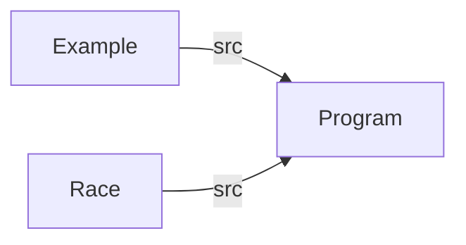

# examples

```mermaid
flowchart LR
  Example -->|src| Program
  Race -->|src| Program
```

Example and race programs as data. Sources stay as text in the original syntax; each example
carries the `def`s it uses, and its `--` lines become the caption.
