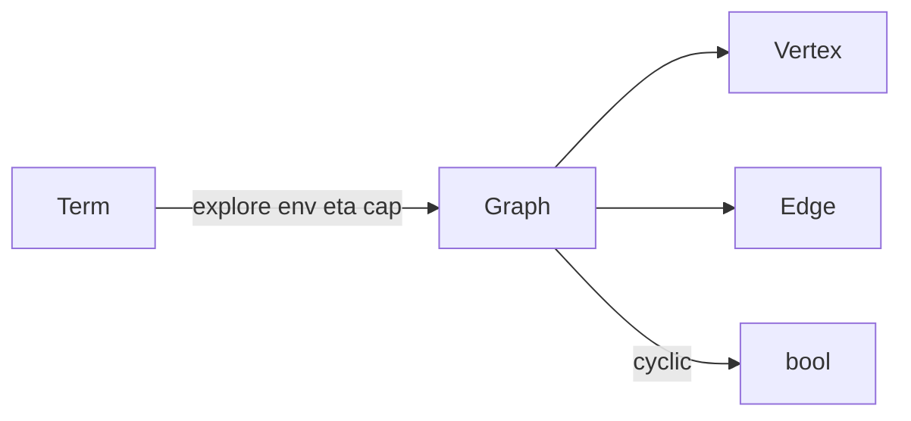

# explore

```mermaid
flowchart LR
  Term -->|explore env eta cap| Graph --> Vertex & Edge
  Graph -->|cyclic| bool
```

Breadth-first exploration of every reduction path, keyed by α-equivalence. Stops expanding past the
cap (the node that would expand is marked open) and skips results over 600 nodes.
