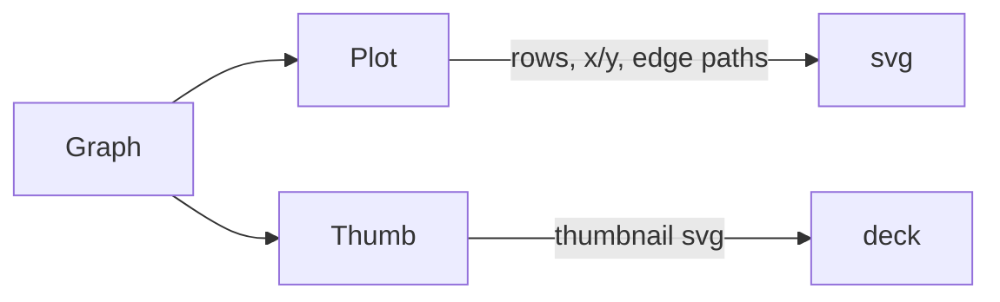

# layout

```mermaid
flowchart LR
  Graph --> Plot -->|rows, x/y, edge paths| svg
  Graph --> Thumb -->|thumbnail svg| deck
```

Pure geometry, no DOM: the graph widget's rows and columns, edge routes (down, same-row arcs,
loop-backs), and the deck's thumbnails. Numbers format exactly as JavaScript prints them.
