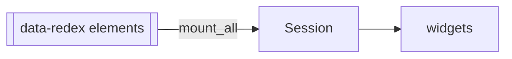

# redex

```mermaid
flowchart LR
  page[[data-redex elements]] -->|mount_all| Session --> widgets
```

The facade: `mount_all` mounts every `[data-redex]` element on the page with one shared session,
and is exported to JavaScript for host pages.
